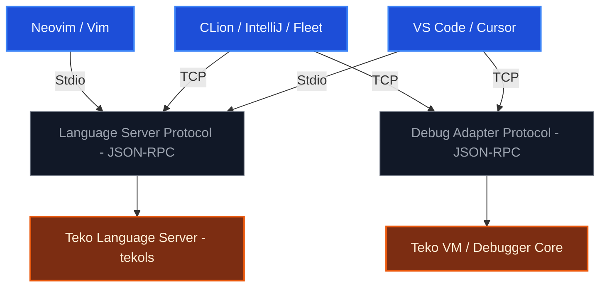
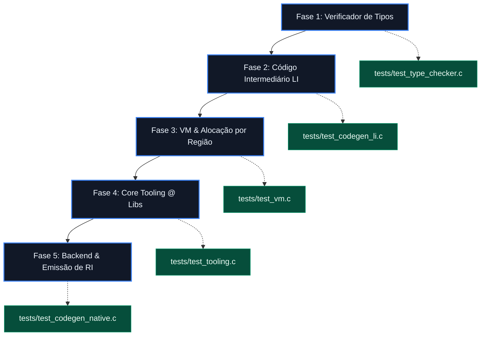

# 🗺️ Plano de Árvore Tecnológica: Linguagem Teko

---

## 🛠️ Fase 1: Verificador de Tipos (Type Checker)
*O Frontend precisa garantir que o código é semanticamente 100% válido antes de qualquer tentativa de tradução.*

*   **1.1 Algoritmo de Inferência e Resolução:**
    *   Implementar o sistema de unificação de tipos para inferência em operadores `:=` (ex: `wg := waiter` infere o tipo `teko::waiter`).
    *   Criar o resolvedor de tipos complexos: genéricos aninhados (`map<str, mut i32>`), nuláveis (`ExternalStructure?`) e aridades de funções (`func<i32, void>`).
*   **1.2 Checagem de Atribuição e Regras de Mutabilidade:**
    *   Garantir barreira contra atribuições inválidas (ex: tentar jogar uma literal `LIT_STR` em um tipo `i32`).
    *   Conectar a AST com a Tabela de Símbolos para travar atribuições em variáveis `let` imutáveis (ex: falhar se houver escrita em um símbolo cujo metadado `is_mutable` seja `false`).
*   **1.3 Validação de Fluxo Assíncrono e Concorrência:**
    *   Validar se expressões `await` são aplicadas estritamente a retornos envelopados em `intent<T>`.
    *   Verificar se blocos `defer` tradicionais **não** contêm expressões `await`, enquanto blocos `async defer` as exigem ou permitem.
*   **🧪 Testes Associados (`tests/test_type_checker.c`):**
    *   Asserções do Unity injetando erros intencionais de mutabilidade e tipos primitivos incompatíveis, validando que o compilador os rejeita.

---

## 💾 Fase 2: Arquitetura da Linguagem Intermediária (LI) e Emissão de Bytecode
*Definição de um formato de instrução compacto e independente de plataforma, ideal para portabilidade e para alimentar a nossa VM.*

*   **2.1 Design da ISA (Instruction Set Architecture) da LI:**
    *   Projetar um conjunto de instruções baseado em registradores virtuais ou pilha (ex: `ICONST`, `STORE_MUT`, `SPAWN_ASYNC`, `CHAN_PUT`, `AWAIT_INTENT`).
    *   Estruturar o formato do arquivo binário compilado (`.tkb` - Teko Bytecode) contendo: Cabeçalho com Magic Number, Tabela de Constantes (Literais, Strings), Metadados de Namespaces/Tipos e o vetor de instruções brutas (*opcodes*).
*   **2.2 O Emissor de Bytecode (Codegen da LI):**
    *   Criar o módulo `src/codegen_li.c` que percorre a AST validada e traduz os nós em instruções lineares da LI.
    *   Mapear o switch inline e blocos condicionalizados `when` em desvios condicionais eficientes de bytecode (`JMP_IF_FALSE`).
*   **🧪 Testes Associados (`tests/test_codegen_li.c`):**
    *   Compilar pequenos trechos sintáticos e inspecionar os bytes gerados na memória para validar se os *opcodes* batem com a especificação da ISA.

---

## 🚀 Fase 3: Máquina Virtual (VM) de Desenvolvimento
*O ambiente de execução ágil, portátil e multiplataforma para o desenvolvedor, responsável por rodar o bytecode `.tkb` de forma performática.*

*   **3.1 O Interpretador Core:**
    *   Implementar o laço de execução principal (`src/vm_core.c`) baseado em um loop `switch-case` otimizado (ou ponteiros de etiquetas/labels se você preferir otimizar no C23) para processar os opcodes da LI.
    *   Criar o subsistema de Contexto e Call Stack isolado por Green Threads / Corrotinas para suportar os métodos assíncronas de forma nativa.
*   **3.2 Motor Concorrente da VM (Green Threads, Canais e Semáforos):**
    *   Desenvolver o **Scheduler M:N** (M Green Threads mapeadas em N threads nativas do OS via `pthread` ou as novas C23 threads).
    *   Implementar as estruturas internas reais de controle para canais síncronos/assíncronos, travamentos de exclusão mútua (`mutex`) e contadores do `waiter`.
*   **3.3 O Alocador por Região Real (Region-Based Memory Management):**
    *   Criar o motor da **Arena de Memória** nativa (a estrutura de runtime que atende ao `ctx: arena` do seu `main`). Toda alocação interna de Green Threads e dados do programa do usuário deve ser empurrada para blocos contínuos da arena, garantindo que o encerramento da arena limpe gigabytes de lixo instantaneamente via O(1) sem necessidade de um Garbage Collector pausando a execução.
*   **🧪 Testes Associados (`tests/test_vm.c`):**
    *   Executar bytecodes que abrem canais, disparam loops concorrentes e validam se o Scheduler distribui a carga e se a Arena limpa a memória perfeitamente.

---

## 🧰 Fase 4: Core Tooling & Framework Nativo (Suporte ao `@`)
*A criação da biblioteca padrão e ferramentas internas da linguagem, escritas no ecossistema e expostas transparentemente através do açúcar sintático `@`.*

*   **4.1 Mapeamento e Ligação dos Namespaces Internos:**
    *   Criar os arquivos de cabeçalho teko (ex: `strings.tk`, `marshall.tk`, `flows.tk`, `lists.tk`, `logger.tk`).
    *   Estruturar o subsistema de **Intrinsics / Builtins** no compilador: quando o Type Checker intercepta um identificador iniciado por `@` (que expandimos para `teko::`), o compilador sabe que deve ligar aquela chamada diretamente às funções internas de alta performance implementadas no runtime da VM ou em C puro (FFI).
*   **4.2 Desenvolvimento das sub-bibliotecas `@` Obrigatórias:**
    *   `@marshall`: Funções de conversão e conversão de ponteiros (`to_ptr`, `from_ptr`) conversas entre tipos Teko e tipos nativos de C (FFI).
    *   `@flows`: Motor arquitetural orientado a eventos para CQRS (`request`, `notify`, `send`), resolvendo a injeção dos Handlers automáticos.
    *   `@lists` e `@strings`: Manipulação de arrays mutáveis, coleções dinâmicas de decimais e concatenações otimizadas.
*   **4.3 O Driver CLI do Compilador:**
    *   Criar o utilitário de terminal principal (`teko compile`, `teko run`).
    *   Injetar a flag de controle de privilégio `is_stdlib_compilation` que criamos. Se o driver CLI compilar a pasta do compilador/stdlib, liga a flag como `true` para permitir o uso de `teko::`; se for projeto de terceiros, força o uso estrito do `@`.
*   **🧪 Testes Associados (`tests/test_tooling.c`):**
    *   Compilar códigos contendo `@strings.concat` e verificar se a expansão sintática e o direcionamento de memória em runtime estão íntegros.

---

## 🎛️ Fase 5: Backend Avançado e Emissão de RI (LLVM / C)
*A etapa definitiva de produção. Quando o usuário precisar de performance máxima de execução (*Ahead-of-Time*), o compilador pula a VM e gera binários nativos otimizados.*

*   **5.1 Transpilação Intermediária para C Puro ou Emissão de RI LLVM:**
    *   **Abordagem Transpilação para C:** Converter a AST validada ou as instruções da LI diretamente em código C estruturado, mapeando as Green Threads para a biblioteca `libuv` ou construções nativas de Threads assíncronas, invocando em seguida o `clang` ou `gcc` local do sistema para gerar o executável binário final.
    *   **Abordagem LLVM RI:** Consumir a API do LLVM para emitir instruções textuais `.ll`, aproveitando as otimizações industriais de registradores e gerando código nativo direto para **arm64** (Mac M1/M2/M3) ou **x86_64** (Intel/AMD).
*   **5.2 Casamento de Tipos e Geração do FFI Fixo:**
    *   Gerar a tradução exata de tipos complexos descritos no bloco `extern struct` ou `extern fn ... from "my.dylib" as "GetMy"`, convertendo strings arbitrárias da Teko em ponteiros `char*` tradicionais de C e vinculando nativamente via `dlopen`/`dlsym` ou linkagem direta.
*   **🧪 Testes Associados (`tests/test_codegen_native.c`):**
    *   Gerar um binário final de um programa completo Teko, executá-lo no sistema operacional hospedeiro e inspecionar se o resultado de saída e o comportamento concorrente condizem com o especificado.

---

# 🗺️ Plano Estratégico: Compilador Teko - Do AOT ao Auto-Controle (Self-Hosting)

Este documento estabelece o roteiro técnico definitivo para as fases finais de desenvolvimento da linguagem **Teko**. O objetivo central é transformar o ecossistema em uma infraestrutura de nível de sistemas puramente **autônoma e autossuficiente**, eliminando por completo a dependência de compiladores e linkadores de terceiros (Clang, GCC, MSVC, Link.exe), e capacitando o compilador a gerar executáveis bare-metal diretamente a partir da escrita de bytes estruturais de arquivos binários de sistemas operacionais.

---

## 🏗️ Visão Geral da Jornada Arquitetural

┌──────────────────────────────┐
│  FASE 6: OTIMIZAÇÕES GLOBAIS │ ➔ Constant Folding, Inlining e Análise de Fluxo
└──────────────┬───────────────┘
               ▼
┌──────────────────────────────┐
│  FASE 7: ENGENHARIA DO LINKER│ ➔ Geração direta de ELF, Mach-O e PE/COFF sem ferramentas externas
└──────────────┬───────────────┘
               ▼
┌──────────────────────────────┐
│  FASE 8: RUNTIME EMBUTIDO    │ ➔ Syscalls Diretas, Alocador Virtual de Arenas e Green Threads
└──────────────┬───────────────┘
               ▼
┌──────────────────────────────┐
│  FASE 9: AUTO-CONTENÇÃO      │ ➔ Bootstrapping do Compilador (Reescrita de C para Teko)
└──────────────────────────────┘

---

## 🚀 FASE 6: Otimizações Globais do Backend Metal
A Fase 6 foca em expandir o motor de análise estática e reordenamento da Linguagem Intermediária (LI) no orquestrador central antes do despacho de instruções para as CPUs.

### 1. Constant Folding (Dobradura de Constantes)
*   **Mecânica:** O otimizador executa uma varredura preditiva buscando operações aritméticas cujos operandos sejam literais conhecidos em tempo de compilação (ex: `OP_ICONST 10`, `OP_ICONST 5`, `OP_ADD`).
*   **Aplicação no Silício:** O compilador colapsa as instruções em tempo de build, computando o resultado e emitindo uma única instrução limpa de carga (`OP_ICONST 15`), poupando ciclos de clock em tempo de execução.

### 2. Inlining Estático Automático de Funções
*   **Mecânica:** O compilador analisa o grafo de controle buscando sub-rotinas pequenas (funções "folha" de tamanho de bytecode reduzido que não efetuam chamadas para terceiros).
*   **Aplicação no Silício:** O opcode de desvio físico (`bl`, `call`, `jal`) é substituído diretamente pela cópia fiel do corpo da função. Isso elimina o custo físico de stack frames, preservação de Link Registers e limpezas de pipeline, destrancando o potencial máximo do CSE e do DCE no bloco expandido.

---

## 🛠️ FASE 7: Engenharia do Linker Nativo Estático (`tld`)
A Fase 7 elimina a chamada ao comando `system()` do sistema hospedeiro. O compilador Teko passará a se comunicar com os kernels gravando os formatos binários executáveis diretamente em disco.

### 1. Escrita Direta de Formatos de Objeto e Cabeçalhos de Executáveis
O backend abandonará a geração de código assembly textual (.s/.asm) e implementará emissores binários para injetar as tabelas estruturais de metadados:
*   **Linux / FreeBSD (Formatos ELF64):** Escrita direta de cabeçalhos ELF (`Elf64_Ehdr`), seções de cabeçalho de programa (`Elf64_Phdr`) e marcas de nota ELF exigidas pelos validadores do Kernel BSD.
*   **macOS (Formato Mach-O):** Escrita de cabeçalhos de arquitetura (`mach_header_64`) e comandos de carga de segmento (`segment_command_64`).
*   **Windows (Formato PE/COFF):** Escrita das estruturas DOS e NT Headers (`IMAGE_DOS_HEADER`, `IMAGE_NT_HEADERS`).

### 2. Mecanismo de Resolução de Símbolos e Relocação (*The Linking Engine*)
*   **Symbol Resolution:** Mapear referências globais cruzadas ligando o código gerado pelo programador às seções de dados estáticos (`.rodata`/`.rdata`).
*   **Relocation Offsets:** Calcular offsets e remendar em tempo de linkagem os endereços virtuais de saltos condicionais longos (`JMP`) e chamadas do runtime, cravando independência total de infraestruturas externas.

---

## 🧵 FASE 8: O Runtime Nativo Embutido (*Teko Core Runtime*)
Para dar suporte aos recursos nativos de concorrência massiva M:N, canais bloqueantes e promoção de escopo por análise de escape, a linguagem embutirá o seu próprio runtime estático de baixo nível escrito de forma bare-metal.

### 1. Subsistema Concorrente M:N Cooperativo Nativo
*   **Unix-Like:** Ingestão de chamadas de sistema puras via instruções assembly (`syscall` / `svc` / `ecall`) invocando a syscall de clonagem (`sys_clone` no Linux) ou gerenciamento de threads nativas do FreeBSD (`thr_new`) para orquestrar o escalonador cooperativo de Green Threads sem carregar a biblioteca libc padrão de C.
*   **Windows:** Linkagem estática limpa orientada aos ponteiros de exportação das APIs do barramento `kernel32.dll` (como `CreateThread` e primitivos atômicos).

### 2. Barramento de Alocação de Arenas Globais
*   Mapeamento e requisição de páginas virtuais de memória diretamente ao sistema operacional via `mmap`/`munmap` no Unix e `VirtualAlloc` no Windows para alimentar em tempo constante $O(1)$ o barramento de arenas locais do compilador, isolando totalmente os escopos de memória.

---

## 🔄 FASE 9: Auto-Contenção (Self-Hosting / Bootstrapping)
A etapa final que coroa a maturidade industrial de uma linguagem de programação de sistemas: usar a própria linguagem para compilar a si mesma.

### 1. Tradução dos Módulos do Compilador de C para Teko
*   O Frontend (Lexer, Parser, AST Parser) e o Backend (Type Checker, Codegen Intermediário, Codegen Metal, Linker) serão inteiramente reescritos usando a sintaxe e os recursos nativos da linguagem Teko (segurança de tipos, controle estrito de mutabilidade e injeção automática de dependências).

### 2. O Ciclo de Execução do Bootstrapping
Para certificar a estabilidade bit-a-bit e a independência total da linguagem, a validação industrial ocorrerá em um ciclo fechado de três estágios de compilação cruzada:
1.  **Estágio 1:** O compilador estável original (escrito em C) lê o novo código-fonte (escrito em Teko). O output gerado é o **Compilador Binário A**.
2.  **Estágio 2:** O **Compilador Binário A** assume o controle e lê o mesmo código-fonte escrito em Teko novamente. O output gerado é o **Compilador Binário B**.
3.  **Estágio 3 (Homologação):** O **Compilador Binário B** compila o código-fonte em Teko uma terceira vez, gerando o **Compilador Binário C**.
4.  **Validação Final:** O **Binário C** e o **Binário B** devem ser rigorosa e matematicamente **bit-a-bit idênticos** em nível de soma de verificação hash. Quando este ciclo fechar, o compilador Teko estará **100% autônomo, livre de C e auto-contido**.

