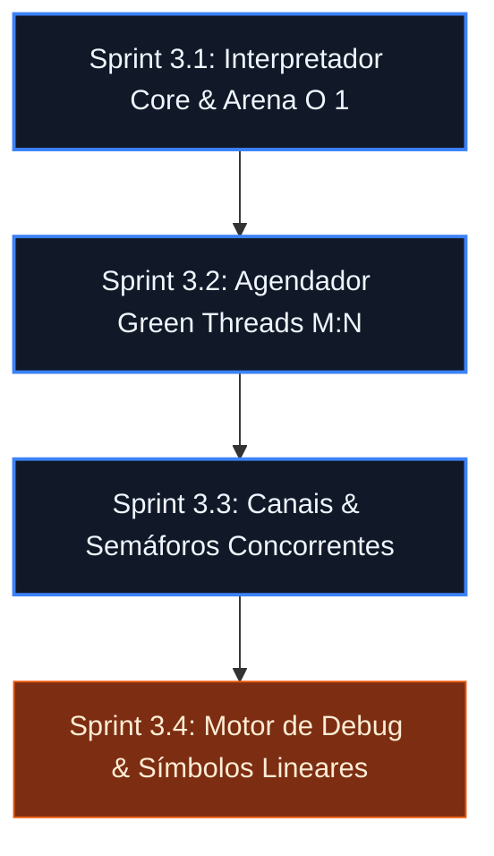

# 🗺️ Plano de Execução Incremental: Fase 3 - Máquina Virtual & Debugger

---

## 🛠️ Sprint 3.1: O Interpretador Core & Alocador Arena ($O(1)$)
*Objetivo: Ler o arquivo compactado `.tkb`, validar o cabeçalho mágico `TEKO` e rodar as instruções sequenciais em uma única thread nativa com alocação em bloco contíguo.*

*   **Entregas em Código (`src/vm_core.c` / `.h`):**
    *   Estrutura `TekoVM` contendo o registrador de instrução `IP` (Instruction Pointer), vetor de registradores virtuais genéricos e ponteiro para o bytecode lido.
    *   O laço principal executado via `while(true)` com técnica de *computed gotos* do C23 para maximizar a performance do desvio de opcodes em vez de um switch lento.
    *   Estrutura da `Arena`: Um `malloc` bruto de uma página de memória (ex: 4KB) onde todas as strings e estruturas alocadas em tempo de execução são inseridas sequencialmente via deslocamento de ponteiro (*offset*). O descarte limpa tudo instantaneamente.
*   **🧪 Teste Unitário Relacionado (`tests/test_vm_core.c`):**
    *   Injetar opcodes aritméticos estruturados e validar se a Arena limpa 100% da memória do runtime em tempo constante $O(1)$ ao fim da execução.

---

## 🔄 Sprint 3.2: O Scheduler M:N & Context Switching de Green Threads
*Objetivo: Implementar o suporte assíncrono real da linguagem, permitindo que a keyword `async` crie corrotinas leves (M) controladas por um agendador rodando em threads nativas (N).*

*   **Entregas em Código (`src/vm_scheduler.c` / `.h`):**
    *   Estrutura `GreenThread` contendo seu próprio estado de registradores, pilha local e status de ciclo de vida (`READY`, `RUNNING`, `BLOCKED`, `DEAD`).
    *   Implementação da troca de contexto (*Context Switching*) manual salvando e restaurando o estado dos registradores virtuais sem depender de chamadas pesadas de kernel.
    *   Mecanismo de *Yielding*: O opcode `OP_SPAWN_ASYNC` suspende a execução da Green Thread corrente e joga a nova tarefa na fila global de prontos do Scheduler.
*   **🧪 Testes Associados (`tests/test_vm_scheduler.c`):**
    *   Simular o disparo de 1000 Green Threads simultâneas executando tarefas de computação pura e checar se o scheduler as alterna perfeitamente sem travar.

---

## 🚦 Sprint 3.3: Canais Síncronos, Bounded e Primitivos de Sincronização
*Objetivo: Dar vida aos operadores concorrentes extraídos do Parser: `chan<T>`, `waiter` e `mutex`, amarrando-os ao estado de bloqueio do Scheduler.*

*   **Entregas em Código (`src/vm_concurrency.c` / `.h`):**
    *   Estrutura interna para canais: Buffer circular thread-safe protegido por travas atômicas se for *bounded*, ou fila encadeada se for *unbounded*.
    *   Sincronização de Bloqueio: Se uma Green Thread executar `OP_CHAN_PUT` (ou leitura) e o canal estiver cheio/vazio, o Scheduler muda o status dela para `BLOCKED` e move o cursor para a próxima tarefa pronta, eliminando o consumo de CPU por *busy-waiting*.
    *   Acoplamento dos métodos nativos homologados: `lock()`, `unlock()`, `add()`, `done()`, `wait()`.
*   **🧪 Testes Associados (`tests/test_vm_channels.c`):**
    *   Um produtor e um consumidor trocando mensagens decimais através de um canal e validando se o Scheduler gerencia as Green Threads bloqueadas.

---

## 🐛 Sprint 3.4: Infraestrutura de Depuração (The Teko Debugger)
*Objetivo: Adicionar suporte nativo à inspeção de estado em tempo de execução, permitindo pausar o interpretador, ler o valor de variáveis locais da Arena e avançar instrução por instrução.*

*   **Entregas em Código (`src/vm_debug.c` / `.h`):**
    *   Geração de um mapa de símbolos lineares em tempo de compilação (*Debug Symbols*) associando o endereço do Bytecode físico com a linha e coluna do arquivo fonte original.
    *   Estrutura de `Breakpoints`: Um vetor de endereços de memória da LI marcados para pausa. Quando o laço do interpretador core atinge um endereço registrado, ele suspende a Green Thread e entra em modo de escuta CLI interativo.
    *   Rotinas de Controle do Motor de Debug: `vm_debug_step_into()`, `vm_debug_continue()`, e a função `vm_debug_inspect_arena()` para mapear o Heap em tempo real.
*   **🧪 Testes Associados (`tests/test_vm_debug.c`):**
    *   Configurar um breakpoint fictício via código no Unity, rodar o interpretador e validar se o estado da VM congela e expõe os registradores com precisão matemática.